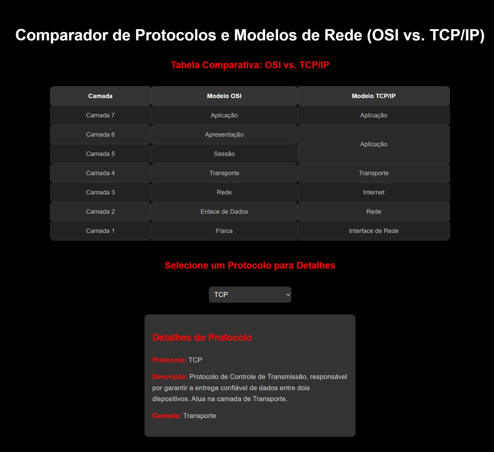

# ProtocolLayerExplorer

**ProtocolLayerExplorer** é uma ferramenta baseada na web projetada para comparar os modelos OSI e TCP/IP, destacando suas semelhanças e diferenças. Ela permite que os usuários explorem as camadas de ambos os modelos, os protocolos associados e fornece informações detalhadas sobre cada protocolo.

## Índice

- [Introdução](#introdução)
- [Imagens](#imagens)
- [Funcionalidades](#funcionalidades)
- [Como Usar](#como-usar)
- [Tecnologias Utilizadas](#tecnologias-utilizadas)
- [Comparação dos Modelos](#comparação-dos-modelos)
- [Protocolos](#protocolos)
- [Licença](#licença)

---

## Introdução

O aplicativo **ProtocolLayerExplorer** oferece uma experiência interativa para comparar dois modelos importantes de redes: OSI (Open Systems Interconnection) e TCP/IP (Transmission Control Protocol/Internet Protocol). Ele apresenta uma visão detalhada de cada camada dos modelos e permite aos usuários visualizar e aprender sobre vários protocolos, como HTTP, TCP, IP, FTP e Ethernet.

---

## Imagens

*Acima está uma captura de tela inicial da aplicação.*

*Acima está uma captura de tela detalhada da aplicação com as principais funcionalidades.*

---

## Funcionalidades

- **Comparação Interativa**: Compare as camadas dos modelos OSI e TCP/IP.
- **Detalhes dos Protocolos**: Obtenha informações detalhadas sobre protocolos como HTTP, TCP, IP, Ethernet e FTP.
- **Interface Amigável**: Interface simples e limpa, com texto claro e fácil de ler.
- **Design Responsivo**: Funciona perfeitamente em dispositivos desktop e móveis.
- **Sem Sobreposição de Seleção**: A tabela e os detalhes dos protocolos são estáticos, garantindo fácil navegação.

---

## Como Usar

1. Abra a aplicação no seu navegador web.
2. Veja a tabela de **Comparação dos Modelos OSI vs. TCP/IP**.
3. Selecione um protocolo no menu suspenso para ver as informações detalhadas.
4. Os detalhes incluem o nome do protocolo, descrição e a camada à qual pertence.

---

## Tecnologias Utilizadas

- **HTML5**: Usado para a estrutura da aplicação.
- **CSS3**: Usado para o design e layout (Design responsivo para dispositivos móveis e desktop).
- **JavaScript**: Usado para gerenciar interações e exibir os detalhes dos protocolos.
  
---

## Comparação dos Modelos

### Modelo OSI (Open Systems Interconnection)

O modelo OSI divide a rede em sete camadas distintas, cada uma com responsabilidades específicas.

| **Camada**     | **Nome**               | **Descrição**                                                                 |
|----------------|------------------------|-------------------------------------------------------------------------------|
| **Camada 7**   | Aplicação              | Fornece serviços ao usuário final, incluindo protocolos de comunicação (ex: HTTP). |
| **Camada 6**   | Apresentação           | Cuida da codificação, criptografia e compressão dos dados.                   |
| **Camada 5**   | Sessão                 | Gerencia as sessões de comunicação entre dispositivos.                        |
| **Camada 4**   | Transporte             | Garante a transmissão confiável de dados (ex: TCP).                           |
| **Camada 3**   | Rede                   | Responsável pelo roteamento dos dados (ex: IP).                               |
| **Camada 2**   | Enlace de Dados        | Gerencia a transferência de dados entre dispositivos na mesma rede.           |
| **Camada 1**   | Física                 | Cuida da transmissão física dos dados (ex: cabos, switches).                 |

---

### Modelo TCP/IP (Transmission Control Protocol/Internet Protocol)

O modelo TCP/IP é uma versão simplificada e amplamente utilizada de rede. Ele consiste em quatro camadas:

| **Camada**     | **Nome**               | **Descrição**                                                                 |
|----------------|------------------------|-------------------------------------------------------------------------------|
| **Camada 4**   | Aplicação              | Suporta aplicativos e serviços de rede (semelhante à camada 7 do OSI).       |
| **Camada 3**   | Transporte             | Garante a entrega confiável dos dados (semelhante à camada 4 do OSI).         |
| **Camada 2**   | Internet               | Gerencia o endereçamento IP, roteamento e encaminhamento de pacotes (semelhante à camada 3 do OSI). |
| **Camada 1**   | Acesso à Rede          | Trata da transmissão de dados entre dispositivos, incluindo Ethernet (semelhante às camadas 2 e 1 do OSI). |

---

## Protocolos

### 1. **HTTP (HyperText Transfer Protocol)**

- **Camada**: Aplicação (Camada 7 do OSI, Camada 4 do TCP/IP)
- **Descrição**: O HTTP é a base da comunicação de dados na Web. É utilizado para transferir solicitações e informações de hipertexto entre clientes (navegadores) e servidores.

### 2. **TCP (Transmission Control Protocol)**

- **Camada**: Transporte (Camada 4 do OSI, Camada 3 do TCP/IP)
- **Descrição**: O TCP é um protocolo orientado à conexão que garante a transmissão confiável dos dados, gerenciando o fluxo de dados e tratando de erros.

### 3. **IP (Internet Protocol)**

- **Camada**: Internet (Camada 3 do OSI, Camada 2 do TCP/IP)
- **Descrição**: O IP é responsável pelo endereçamento e roteamento dos pacotes de dados entre redes diferentes, garantindo que os dados cheguem ao destino correto.

### 4. **Ethernet**

- **Camada**: Acesso à Rede (Camada 2 do OSI, Camada 1 do TCP/IP)
- **Descrição**: O Ethernet é a tecnologia de rede local mais utilizada, definindo como os dados são transmitidos dentro de uma rede local utilizando endereços MAC.

### 5. **FTP (File Transfer Protocol)**

- **Camada**: Aplicação (Camada 7 do OSI, Camada 4 do TCP/IP)
- **Descrição**: O FTP é usado para transferir arquivos entre sistemas através de uma rede. Ele opera na camada de aplicação e fornece conexões de controle e dados.

---

## Licença

Este projeto está licenciado sob a Licença MIT - veja o arquivo [LICENSE](LICENSE) para mais detalhes.

---

### Notas Adicionais

- Esta ferramenta foi desenvolvida para fins educacionais e visa ajudar profissionais de redes e entusiastas a entender melhor os modelos OSI e TCP/IP.
- Fique à vontade para contribuir com o projeto enviando problemas ou pull requests no GitHub.

## Créditos

Desenvolvido por Mateus S.  
GitHub: [Matz-Turing](https://github.com/Matz-Turing)
